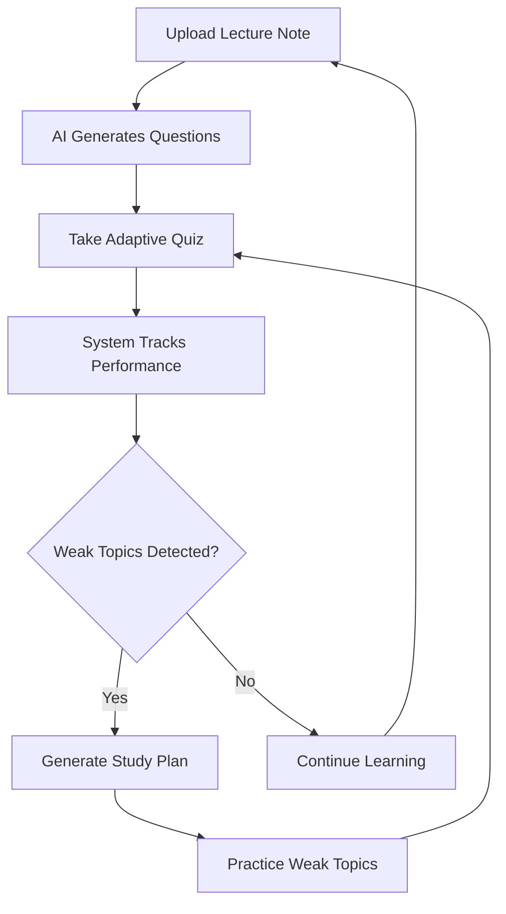
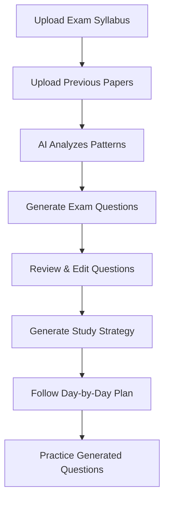

# LearnFlow 📚

**LearnFlow** is an AI-powered adaptive learning platform that helps students master their subjects through intelligent question generation, personalized study plans, and exam preparation tools.

## 🌟 Key Features

### 1. **AI-Powered Question Generation**
- Upload lecture notes (text or PDF) and automatically generate high-quality MCQ questions
- Questions include difficulty levels (0.2-0.9), explanations, and topic tagging
- Powered by Google's Gemini 2.0 Flash AI model

### 2. **Adaptive Learning System**
- **Topic Mastery Tracking**: ML-based algorithm tracks mastery levels (0-1 scale) for each topic
- **Weakness Detection**: Identifies weak topics based on answer correctness and time taken
- **Adaptive Question Selection**: Selects questions based on:
  - User's weak topics (50% of questions)
  - Target difficulty matching user's accuracy
  - Avoids recently answered questions

### 3. **Intelligent Analytics**
- Real-time progress tracking (accuracy, total questions, correct answers)
- Topic-wise weakness scores with time-based analysis
- User streaks (global and per-topic)
- Quiz attempt history with performance metrics

### 4. **Personalized Study Plans**
- AI-generated study plans based on:
  - Identified weak topics
  - User's learning history
  - Recommended resources (articles, videos, explanations)
  - Practice and revision schedules

### 5. **Exam Preparation Module**
- **Syllabus Upload**: Upload exam syllabi (text or PDF)
- **Previous Paper Analysis**: Upload previous question papers for pattern recognition
- **AI Question Generation**: Generate exam questions with:
  - Custom mark distribution (e.g., 2 marks: 5 questions, 5 marks: 3 questions)
  - Priority-based ordering (most important topics first)
  - Pattern-based questions from previous papers
  - "Secure Centum Mode" for comprehensive coverage
- **Exam Strategy Generator**: Creates day-by-day study schedules based on:
  - Days remaining until exam
  - Hours available per day
  - Prioritized topics from pattern analysis

### 6. **Flashcard Generation**
- Generate flashcards from lecture notes for quick revision
- AI-powered content summarization

### 7. **Lecture Summarization**
- Automatically summarize lengthy lecture notes
- Extract key concepts and important points

### 8. **User Authentication**
- JWT-based authentication with access and refresh tokens
- Google OAuth 2.0 integration for social login
- User profile management with avatars and bio

### 9. **Notification System**
- Real-time notifications for:
  - Question generation completion
  - Quiz completion with performance feedback
  - Study milestones and achievements
- Mark as read/unread functionality
- Bulk notification management

### 10. **Badge System**
### 11. **Smart OCR & Noise Reduction**
- Automatically detects "Scanned" vs "Digital" PDFs
- advanced "Exam-Ready" noise filter removes:
  - Headers, Footers, Page numbers
  - Conversational filler & decorative text
  - Hyphenated line breaks
- Uses Tesseract OCR for image-based documents

### 12. **Deep Dive Video Explainers**
- Generate "Podcast-style" video scripts with two distinct speakers (Host & Expert)
- Parallel asset generation for near-zero latency
- Cinematic slides with glassmorphism overlays and AI-generated imagery

### 13. **Latency-Optimized Architecture**
- **Interactive Features** (Quiz, Planner): Powered by Mistral 7B (~3s latency)
- **Creative Features** (Video, Flashcards): Powered by Llama 3 70B (High Intelligence)

---

## 🏗️ Technology Stack

### Backend
- **Framework**: Django 5.2.8
- **API**: Django REST Framework with JWT authentication
- **Database**: SQLite (development) - easily switchable to PostgreSQL/MySQL
- **AI Integration**: Hybrid Engine (Google Gemini 2.0 Flash + Mistral 7B + Llama 3)
- **PDF Processing**: Hybrid OCR Pipeline (Tesseract + Poppler + pdfplumber)
- **Authentication**: 
  - `rest_framework_simplejwt` for JWT tokens
  - `django-allauth` for Google OAuth

### Frontend
- **Framework**: React 19.2.0
- **UI Library**: Material-UI (MUI) 7.3.5
- **Styling**: TailwindCSS 4.1.17 + Emotion
- **Routing**: React Router DOM 7.9.6
- **HTTP Client**: Axios 1.13.2
- **Animations**: Framer Motion 12.23.24
- **Charts**: Recharts 3.4.1
- **Markdown Rendering**: react-markdown 10.1.0
- **Diagrams**: Mermaid 11.12.1
- **File Upload**: react-dropzone 14.3.8

---

## 📋 Prerequisites

- **Python**: 3.8 or higher
- **Node.js**: 14.x or higher
- **npm**: 6.x or higher
- **Tesseract-OCR**: v5.0+ (Required for Scanned PDFs)
- **Poppler**: (Required for PDF-to-Image conversion)
- **Google Gemini API Key**: [Get it here](https://makersuite.google.com/app/apikey)
- **Google OAuth Credentials** (optional): For social login

---

## 🚀 Installation & Setup

### 1. Clone the Repository
```bash
git clone https://github.com/yourusername/LearnFlow.git
cd LearnFlow
```

### 2. Backend Setup

#### Create Virtual Environment
```bash
python -m venv venv

# Windows
venv\Scripts\activate

# macOS/Linux
source venv/bin/activate
```

#### Install Dependencies
```bash
pip install django djangorestframework django-cors-headers djangorestframework-simplejwt google-generativeai pdfplumber python-dotenv django-allauth
```

#### Configure Environment Variables
Create a `.env` file in the root directory:
```env
GEMINI_API_KEY=your_gemini_api_key_here
```

#### Run Migrations
```bash
python manage.py makemigrations
python manage.py migrate
```

#### Create Superuser
```bash
python manage.py createsuperuser
```

#### Start Backend Server
```bash
python manage.py runserver
```
Backend will run at `http://localhost:8000`

### 3. Frontend Setup

#### Navigate to Frontend Directory
```bash
cd frontend
```

#### Install Dependencies
```bash
npm install
```

#### Start Frontend Server
```bash
npm start
```
Frontend will run at `http://localhost:3000`

---

## 🔐 Google OAuth Setup (Optional)

Follow the detailed guide in [GOOGLE_OAUTH_SETUP.md](./GOOGLE_OAUTH_SETUP.md)

**Quick Steps:**
1. Create OAuth credentials in [Google Cloud Console](https://console.cloud.google.com/)
2. Add redirect URI: `http://localhost:8000/accounts/google/login/callback/`
3. Configure in Django Admin (`/admin`) under **Social applications**
4. Add Client ID and Secret

---

## 📡 API Endpoints

### Authentication
| Method | Endpoint | Description |
|--------|----------|-------------|
| POST | `/api/auth/register/` | Register new user |
| POST | `/api/auth/login/` | Login (returns JWT tokens) |
| POST | `/api/auth/refresh/` | Refresh access token |
| GET | `/api/auth/me/` | Get current user details |
| GET | `/accounts/google/login/` | Google OAuth login |

### Lecture Notes
| Method | Endpoint | Description |
|--------|----------|-------------|
| POST | `/api/upload-note/` | Upload lecture note (text/PDF) |
| GET | `/api/lectures/` | List all lecture notes |
| GET | `/api/lectures/{id}/` | Get specific lecture note |
| GET | `/api/note-details/{note_id}/` | Get note details |
| POST | `/api/upload-pdf/` | Upload PDF (Supports Digital & Scanned via OCR) |
| POST | `/api/lectures/{note_id}/summarize/` | Summarize lecture note |

### Questions & Quizzes
| Method | Endpoint | Description |
|--------|----------|-------------|
| POST | `/api/generate-questions/{note_id}/` | Generate 5 MCQ questions |
| POST | `/api/generate-mcqs/` | Generate MCQs (batch) |
| GET | `/api/quiz/{note_id}/` | Get quiz questions (default 20) |
| POST | `/api/submit-mcq/` | Submit MCQ answer |
| POST | `/api/adaptive/quiz/start/` | Start adaptive quiz |
| POST | `/api/quiz-completed/` | Mark quiz as completed |
| PUT | `/api/questions/{question_id}/update/` | Update question |

### Analytics & Progress
| Method | Endpoint | Description |
|--------|----------|-------------|
| GET | `/api/weak-topics/` | Get weak topics for a note |
| GET | `/api/progress/` | Get overall progress |
| GET | `/api/analytics/{note_id}/` | Get analytics for specific note |
| GET | `/api/recent-weak-topics/` | Get recent weak topics |
| GET | `/api/next-actions/` | Get recommended next actions |
| GET | `/api/ai-insights/{note_id}/` | Get AI-powered insights |

### Study Plans
| Method | Endpoint | Description |
|--------|----------|-------------|
| POST | `/api/study-plan/` | Generate personalized study plan |
| GET | `/api/study-plan/{note_id}/` | Get study plan for note |

### Flashcards
| Method | Endpoint | Description |
|--------|----------|-------------|
| POST | `/api/flashcards/generate/` | Generate flashcards |

### Exam Preparation
| Method | Endpoint | Description |
|--------|----------|-------------|
| GET | `/api/exam/syllabi/` | List all exam syllabi |
| POST | `/api/exam/syllabus/upload/` | Upload exam syllabus |
| POST | `/api/exam/syllabus/{syllabus_id}/papers/` | Upload previous papers |
| POST | `/api/exam/syllabus/{syllabus_id}/generate/` | Generate exam questions |
| GET | `/api/exam/syllabus/{syllabus_id}/questions/` | Get exam questions |
| POST | `/api/exam/syllabus/{syllabus_id}/strategy/` | Generate exam strategy |
| PUT | `/api/exam/question/{question_id}/update/` | Update exam question |
| DELETE | `/api/exam/question/{question_id}/delete/` | Delete exam question |

### Notifications
| Method | Endpoint | Description |
|--------|----------|-------------|
| GET | `/api/notifications/` | List all notifications |
| POST | `/api/notifications/{id}/mark-read/` | Mark notification as read |
| POST | `/api/notifications/mark-all-read/` | Mark all as read |
| DELETE | `/api/notifications/{id}/delete/` | Delete notification |

### Video Generation
| Method | Endpoint | Description |
|--------|----------|-------------|
| POST | `/api/video/generate/` | Generate video script, audio, and slides |

### User Profile
| Method | Endpoint | Description |
|--------|----------|-------------|
| GET | `/api/profile/` | Get user profile |
| PUT | `/api/profile/` | Update user profile |

---

## 🗄️ Database Models

### Core Models

#### **LectureNote**
- `user` (ForeignKey): Owner of the note
- `title` (CharField): Note title
- `file` (FileField): Uploaded PDF file
- `content` (TextField): Extracted/input text content
- `created_at` (DateTimeField): Creation timestamp

#### **Question**
- `lecture_note` (ForeignKey): Associated lecture note
- `topic` (CharField): Question topic
- `question_text` (TextField): Question content
- `option_a`, `option_b`, `option_c`, `option_d` (TextField): MCQ options
- `correct_option` (CharField): Correct answer (A/B/C/D)
- `explanation` (TextField): Answer explanation
- `difficulty` (FloatField): Difficulty level (0.2-0.9)

#### **UserAnswer**
- `user` (ForeignKey): User who answered
- `question` (ForeignKey): Question answered
- `user_answer` (TextField): User's selected option
- `is_correct` (BooleanField): Correctness flag
- `time_taken` (IntegerField): Time in seconds
- `answered_at` (DateTimeField): Timestamp

#### **TopicWeakness**
- `lecture_note` (ForeignKey): Associated note
- `user` (ForeignKey): User
- `topic` (CharField): Topic name
- `weakness_score` (FloatField): Weakness score (0.0-2.0)

#### **TopicMastery**
- `user` (ForeignKey): User
- `lecture_note` (ForeignKey): Associated note
- `topic` (CharField): Topic name
- `mastery` (FloatField): Mastery level (0.0-1.0)
- `last_updated` (DateTimeField): Last update timestamp

#### **UserStreak**
- `user` (ForeignKey): User
- `topic` (CharField): Topic (null for global streak)
- `streak` (IntegerField): Current streak count
- `last_updated` (DateTimeField): Last update timestamp

#### **QuizAttempt**
- `user` (ForeignKey): User
- `lecture_note` (ForeignKey): Associated note
- `score` (IntegerField): Score achieved
- `total_questions` (IntegerField): Total questions
- `completed_at` (DateTimeField): Completion timestamp

#### **Badge**
- `user` (ForeignKey): User
- `name` (CharField): Badge name
- `description` (TextField): Badge description
- `icon` (CharField): Badge icon/emoji
- `earned_at` (DateTimeField): Earned timestamp

### Exam Preparation Models

#### **ExamSyllabus**
- `user` (ForeignKey): Owner
- `title` (CharField): Syllabus title
- `content` (TextField): Syllabus content
- `file` (FileField): Uploaded PDF
- `created_at`, `updated_at` (DateTimeField): Timestamps

#### **PreviousQuestionPaper**
- `exam_syllabus` (ForeignKey): Associated syllabus
- `file` (FileField): Uploaded PDF
- `content` (TextField): Extracted text
- `uploaded_at` (DateTimeField): Upload timestamp

#### **ExamQuestion**
- `exam_syllabus` (ForeignKey): Associated syllabus
- `question_text` (TextField): Question
- `answer` (TextField): Detailed answer
- `marks` (IntegerField): Mark weightage
- `priority` (IntegerField): Priority (1 = highest)
- `topic` (CharField): Topic
- `is_from_pattern` (BooleanField): Based on previous papers

#### **ExamConfiguration**
- `exam_syllabus` (ForeignKey): Associated syllabus
- `total_marks` (IntegerField): Total marks
- `num_questions` (IntegerField): Number of questions
- `mark_distribution` (JSONField): Mark distribution config
- `secure_centum_mode` (BooleanField): Secure centum flag

---

## 🔄 Workflows & Procedures

### 1. **Basic Learning Workflow**



**Steps:**
1. **Upload Note**: POST `/api/upload-note/` with title and content
2. **Generate Questions**: POST `/api/generate-questions/{note_id}/`
3. **Start Quiz**: GET `/api/quiz/{note_id}/?n=20`
4. **Submit Answers**: POST `/api/submit-mcq/` for each question
5. **View Analytics**: GET `/api/analytics/{note_id}/`
6. **Get Study Plan**: POST `/api/study-plan/`

### 2. **Exam Preparation Workflow**



**Steps:**
1. **Upload Syllabus**: POST `/api/exam/syllabus/upload/` with PDF/text
2. **Upload Papers**: POST `/api/exam/syllabus/{id}/papers/` with PDF files
3. **Generate Questions**: POST `/api/exam/syllabus/{id}/generate/` with config:
   ```json
   {
     "total_marks": 100,
     "num_questions": 10,
     "mark_distribution": {"2": 5, "5": 3, "10": 2},
     "secure_centum_mode": false
   }
   ```
4. **Get Questions**: GET `/api/exam/syllabus/{id}/questions/`
5. **Generate Strategy**: POST `/api/exam/syllabus/{id}/strategy/` with:
   ```json
   {
     "days_remaining": 5,
     "hours_per_day": 4
   }
   ```

### 3. **Adaptive Learning Algorithm**

**Weakness Scoring:**
- **Wrong Answer**: `weakness_score += 0.15 + (difficulty * 0.15)`
- **Correct but Slow**: `weakness_score += 0.03-0.08 * difficulty`
- **Correct and Fast**: `weakness_score -= 0.1-0.15 * mastery_gain`

**Mastery Calculation:**
- **Learning Rate**: 0.05-0.12 based on difficulty
- **Correct**: `mastery += lr * (1.0 - current_mastery)`
- **Wrong**: `mastery -= lr * 0.6 * current_mastery`
- **Clamped**: 0.0 to 1.0

**Question Selection:**
1. 50% from weak topics (easier questions first)
2. 50% matching target difficulty based on accuracy
3. Avoids last 100 answered questions

---

## 🧪 Testing

### Backend Tests
```bash
# Run all tests
python manage.py test

# Test specific app
python manage.py test core

# Verify models
python check_models.py
python list_models.py
```

### Frontend Tests
```bash
cd frontend
npm test
```

---

## 🛠️ Utility Scripts

- **`check_django_key.py`**: Verify Django settings and Gemini API key
- **`test_gemini.py`**: Test Gemini API connectivity
- **`test_api_key.py`**: Validate Gemini API key
- **`verify_quiz_count.py`**: Verify quiz question counts
- **`reproduce_study_plan.py`**: Test study plan generation

---

## 📊 Configuration

### Django Settings (`backend/settings.py`)

```python
# JWT Token Lifetimes
SIMPLE_JWT = {
    'ACCESS_TOKEN_LIFETIME': timedelta(minutes=60),
    'REFRESH_TOKEN_LIFETIME': timedelta(days=1),
}

# CORS Configuration
CORS_ALLOW_ALL_ORIGINS = True  # Change in production

# Gemini API
GEMINI_API_KEY = os.getenv("GEMINI_API_KEY")
```

### Frontend API Configuration

Update `src/config.js` (if exists) or use environment variables:
```javascript
const API_BASE_URL = 'http://localhost:8000/api';
```

---

## 🚨 Troubleshooting

### Common Issues

**1. Gemini API 429 Rate Limit**
- The system has built-in retry logic with exponential backoff
- Wait a few seconds and try again

**2. PDF Extraction Fails**
- The system now supports SCANNED PDFs via Tesseract OCR.
- Ensure `Tesseract-OCR` is installed on the server.
- Ensure `poppler-utils` (or `pdftoppm`) is in the System PATH.

**3. Questions Not Generating**
- Check Gemini API key in `.env`
- Verify API key with `python test_gemini.py`
- Check backend logs for detailed errors

**4. Google OAuth Not Working**
- Verify redirect URI matches exactly
- Check Site configuration in Django admin
- Ensure Social Application is configured

**5. CORS Errors**
- Verify `CORS_ALLOW_ALL_ORIGINS = True` in settings
- Check frontend is running on port 3000

---

## 📈 Performance Optimization

### Backend
- Use database indexing on frequently queried fields
- Implement caching for analytics endpoints
- Use pagination for large question lists

### Frontend
- Lazy load components with React.lazy()
- Memoize expensive calculations
- Use virtual scrolling for long lists

---

**Happy Learning! 🎓**
