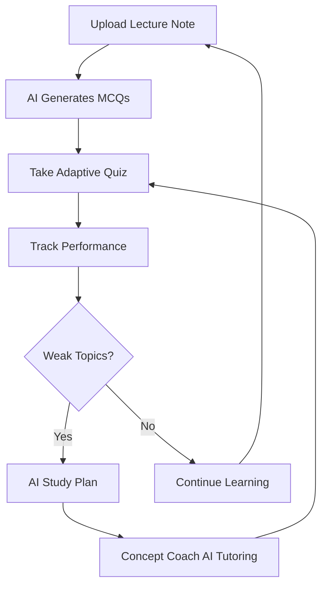
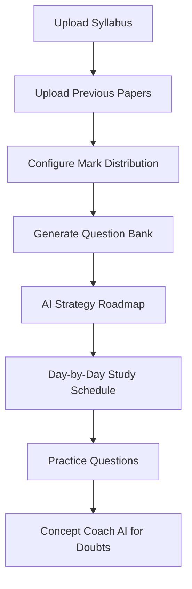

# LearnFlow 📚

> **An adaptive, intelligence-driven learning platform** — built for students who want to study smarter, prepare for exams with confidence, and get personalized guidance from a cognitive tutor that teaches, not just answers.

---

## 🌟 Feature Overview

| Feature | Description |
|---|---|
| 🤖 **Concept Coach** | Interactive Socratic tutor with explain/hint/quiz-oriented guidance |
| 📝 **Rubric Evaluator** | Upload assignments and get detailed rubric-based intelligent feedback |
| 📖 **Exam Preparation** | Syllabus upload, previous paper analysis, question bank generation |
| 📅 **AI Strategy Roadmap** | Day-by-day exam study schedule tailored to your syllabus |
| 🧠 **Adaptive Quizzes** | ML-powered quiz engine that targets your weak areas |
| 🗂️ **Flashcard Generator** | AI-generated flashcards from your lecture notes |
| 📄 **Lecture Summarizer** | Automatically summarizes lengthy lecture PDFs |
| 📊 **Study Plan** | Long-term AI study plans based on your weaknesses |
| 📈 **Analytics Dashboard** | Real-time mastery tracking, streaks, and performance metrics |
| 🏷️ **Subject Intelligence** | Auto-detected subjects with color-coded grouping across lectures, weak topics, and planning |
| 📌 **Sticky Notes Sidebar** | Drag selected PDF text into categorized notes (Lecture, Hint, Exam, Formula) |
| 🏦 **Question Bank** | Search/filter questions by subject and Bloom level with quick-attempt and export |
| 🔐 **Auth System** | JWT + Google OAuth 2.0 |

---

## 🚀 Core Features

### 1. 🤖 Concept Coach AI *(Flagship Feature)*

An interactive AI tutor modelled after the **Socratic method** — it never just gives you the answer. Instead it:

- Guides you step-by-step with targeted **hints**, **formulas**, and **guided questions**
- Teaches like a real teacher: confirms understanding before moving on
- Renders rich responses: **bold**, `code`, numbered steps, formula boxes, markdown headings
- **Quick action chips**: "Give me a hint", "Show the formula", "Explain differently", "I got it, next step"
- Full **Gemini-style chat UI** with typing indicator, copy, thumbs up/down, and a new-chat button
- Powered by a **Socratic system prompt** via Gemini AI on the backend

### 2. 📝 AI Rubric Evaluator

Upload any assignment (PDF, DOCX, TXT) for intelligent rubric-based feedback:

- **Overall Score** with colour-coded rating
- **Content Accuracy** and **Clarity & Logic** sub-scores with progress bars
- **Originality Check** with a circular gauge
- **Top Strengths** and **Actionable Suggestions** from AI
- Clean dark AI feedback panel with export option

### 3. 📖 Exam Preparation — Question Bank Generator

- Upload syllabus (PDF or text) and previous question papers **independently**
- Questions only generate when you explicitly click **"Generate Questions"** — no premature generation
- **Configure mark distribution**: set how many questions per mark tier (e.g., 2-mark × 5, 5-mark × 3, 10-mark × 2)
- AI analyses syllabus deeply and generates detailed answers calibrated to each mark value
- Filter questions by **All / Frequent / Long Answer**
- **Bookmark** questions and toggle "Secure Centum Mode" for comprehensive coverage
- High-Yield Pattern badges on questions derived from previous paper analysis

### 4. 📅 AI Strategy Roadmap *(Exam-Focused)*

- Input your **exam date** and **daily available hours**
- AI generates a day-by-day study schedule in a clean **inline table format**
- Shows total days, study hours, and topics covered in a summary bar
- Priorities are automatically derived from syllabus + previous paper patterns
- This is distinct from the **Study Plan** (which is for long-term learning)

### 5. 🧠 Adaptive Quiz Engine

- Generates MCQs from uploaded lecture notes using Gemini AI
- Tracks topic mastery (0.0–1.0) and weakness scores per topic
- Adaptive question selection:
  - 50% from identified weak topics
  - 50% matching your current accuracy-based difficulty
  - Avoids recently answered questions
- Detailed results with time-taken, correct/incorrect breakdown, and explanations

### 6. 📊 Study Plan *(Long-Term Preparation)*

- AI-generated plans based on identified weak topics and learning history
- Includes recommended resources, revision schedules, and practice prompts
- Clearly differentiated from the Exam Strategy Roadmap

### 7. 🗂️ Flashcard Generator

- Auto-generate flashcards from lecture notes
- Flip-to-reveal interaction, bookmark support, spaced-repetition ready

### 8. 📄 Lecture Summarizer & Notes

- Upload PDF or text lecture notes
- AI-generated summaries with key concepts extracted
- Smart OCR pipeline for scanned PDFs (Tesseract + Poppler)
- Windows Explorer-style PDF preview panel

### 9. 📈 Analytics Dashboard

- Real-time accuracy, total questions, correct answers
- Per-topic weakness scores with mastery progression
- Quiz attempt history with performance metrics
- User streaks (global and per-topic)

---

## 🛣️ Roadmap Snapshot

### 📚 Lecture Workspace 2.0 (Planned)

- Section-based lecture organization (chapters/topics instead of a flat file list)
- Graph-style linkage between PDFs, notes, flashcards, and extracted key points
- Better PDF study flow with section anchors, quick jumps, and selection-to-notes actions
- Notes as first-class lecture objects with pinning, tagging, and page-linked references

### 🤖 Concept Coach 2.0 (Planned)

- Multi-mode tutoring: Explain, Hint, Quiz-me, Exam mode, and Review mode
- Stronger context awareness from current lecture, weak topics, and quiz mistakes
- Better answer structure (definition, intuition, example, recap, key takeaway)
- One-click learning actions: turn answer into flashcard, save as note, or start follow-up quiz
- Session continuity improvements (named sessions, resumable context, thread summaries)

### 🔗 Cross-Feature Integrations (Planned)

- Start Concept Coach directly from weak-topic chips and quiz errors
- Promote lecture notes/highlights into Concept Coach prompts
- Convert useful coach responses into flashcards and revision notes
- Feed smart recommendations from quiz performance into next coaching steps

---

## 🏗️ Technology Stack

### Backend
| Layer | Technology |
|---|---|
| Framework | Django 5.x + Django REST Framework |
| Auth | `rest_framework_simplejwt` (JWT) + `django-allauth` (Google OAuth) |
| Database | SQLite (dev) — easily switchable to PostgreSQL |
| AI Engine | **Google Gemini 2.0 Flash** via `google-generativeai` |
| PDF Processing | Hybrid pipeline: `pdfplumber` + Tesseract OCR + Poppler |
| File Storage | Django media files |

### Frontend
| Layer | Technology |
|---|---|
| Framework | React 19 |
| UI Library | Material-UI (MUI) v7 |
| Routing | React Router DOM v7 |
| HTTP Client | Axios |
| File Upload | react-dropzone |
| Charts | Recharts |
| Animations | Framer Motion |
| Design System | Glassmorphism dark theme with gradient accents |

---

## 🗂️ App Navigation

The sidebar contains all main sections, with **Concept Coach AI** highlighted as the flagship feature:

```
📊  Dashboard
📖  Lecture Notes
❓  Practice Arena (Quiz)
📅  Study Plan
🎓  Exam Prep
🗃️  Flashcards
📄  Summarize Lecture
✦  Concept Coach AI       ← MAIN FEATURE
📋  Rubric Evaluator
👤  Profile
```

---

## 📋 Prerequisites

- **Python** 3.8+
- **Node.js** 16+, **npm** 8+
- **Tesseract-OCR** v5.0+ *(for scanned PDFs)*
- **Poppler** *(for PDF-to-image conversion)*
- **Google Gemini API Key** — [Get one here](https://makersuite.google.com/app/apikey)
- **Google OAuth Credentials** *(optional)* — for Google social login

---

## 🚀 Installation & Setup

### 1. Clone the Repository
```bash
git clone https://github.com/yourusername/LearnFlow.git
cd LearnFlow
```

### 2. Backend Setup

```bash
# Create and activate virtual environment
python -m venv venv
venv\Scripts\activate          # Windows
# source venv/bin/activate     # macOS/Linux

# Install dependencies
pip install -r requirements.txt

# Configure environment
cp .env.example .env
# → Edit .env and set GEMINI_API_KEY=your_key_here

# Run migrations
python manage.py makemigrations
python manage.py migrate

# Create admin superuser
python manage.py createsuperuser

# Start server
python manage.py runserver
# → Running at http://localhost:8000
```

### 3. Frontend Setup

```bash
cd frontend

npm install

npm start
# → Running at http://localhost:3000
```

---

## 🔐 Google OAuth Setup *(Optional)*

See [GOOGLE_OAUTH_SETUP.md](./GOOGLE_OAUTH_SETUP.md) for the full guide.

**Quick Steps:**
1. Create OAuth credentials in [Google Cloud Console](https://console.cloud.google.com/)
2. Add redirect URI: `http://localhost:8000/accounts/google/login/callback/`
3. Configure in Django Admin (`/admin`) under **Social Applications**

---

## 📡 API Endpoints

### Authentication
| Method | Endpoint | Description |
|--------|----------|-------------|
| POST | `/api/auth/register/` | Register new user |
| POST | `/api/auth/login/` | Login — returns JWT tokens |
| POST | `/api/auth/refresh/` | Refresh access token |
| GET | `/api/auth/me/` | Get current user details |
| GET | `/accounts/google/login/` | Google OAuth login |

### Lecture Notes
| Method | Endpoint | Description |
|--------|----------|-------------|
| POST | `/api/upload-note/` | Upload lecture note (text/PDF) |
| POST | `/api/upload-pdf/` | Upload PDF with OCR support |
| GET | `/api/lectures/` | List all lecture notes |
| GET | `/api/lectures/{id}/` | Get specific lecture note |
| POST | `/api/lectures/{note_id}/summarize/` | Summarize lecture note |

### Questions & Quizzes
| Method | Endpoint | Description |
|--------|----------|-------------|
| POST | `/api/generate-questions/{note_id}/` | Generate MCQ questions |
| GET | `/api/quiz/{note_id}/` | Get quiz questions |
| POST | `/api/submit-mcq/` | Submit MCQ answer |
| POST | `/api/adaptive/quiz/start/` | Start adaptive quiz |
| POST | `/api/quiz-completed/` | Mark quiz as completed |

### Analytics & Progress
| Method | Endpoint | Description |
|--------|----------|-------------|
| GET | `/api/weak-topics/` | Get weak topics for a note |
| GET | `/api/progress/` | Get overall progress |
| GET | `/api/analytics/{note_id}/` | Get analytics for specific note |
| GET | `/api/next-actions/` | Get recommended next actions |
| GET | `/api/ai-insights/{note_id}/` | Get AI-powered insights |

### Study Plans
| Method | Endpoint | Description |
|--------|----------|-------------|
| POST | `/api/study-plan/` | Generate personalized study plan |
| GET | `/api/study-plan/{note_id}/` | Get study plan for note |

### Flashcards
| Method | Endpoint | Description |
|--------|----------|-------------|
| POST | `/api/flashcards/generate/` | Generate flashcards for a note |

### Exam Preparation
| Method | Endpoint | Description |
|--------|----------|-------------|
| GET | `/api/exam/syllabi/` | List all uploaded syllabi |
| POST | `/api/exam/syllabus/upload/` | Upload exam syllabus (PDF/text) |
| POST | `/api/exam/syllabus/{id}/papers/` | Upload previous question papers |
| POST | `/api/exam/syllabus/{id}/generate/` | Generate exam questions with mark config |
| GET | `/api/exam/syllabus/{id}/questions/` | Get generated exam questions |
| POST | `/api/exam/syllabus/{id}/strategy/` | Generate AI study strategy roadmap |
| PUT | `/api/exam/question/{id}/update/` | Update exam question |
| DELETE | `/api/exam/question/{id}/delete/` | Delete exam question |

### Concept Coach AI
| Method | Endpoint | Description |
|--------|----------|-------------|
| POST | `/api/ai-tutor/chat/` | Send a chat message — AI responds using Socratic method |

### Rubric Evaluator
| Method | Endpoint | Description |
|--------|----------|-------------|
| POST | `/api/ai-tutor/evaluate/` | Upload assignment for rubric-based AI evaluation |

### Notifications
| Method | Endpoint | Description |
|--------|----------|-------------|
| GET | `/api/notifications/` | List all notifications |
| POST | `/api/notifications/{id}/mark-read/` | Mark as read |
| POST | `/api/notifications/mark-all-read/` | Mark all as read |
| DELETE | `/api/notifications/{id}/delete/` | Delete notification |

### User Profile
| Method | Endpoint | Description |
|--------|----------|-------------|
| GET | `/api/profile/` | Get user profile |
| PUT | `/api/profile/` | Update user profile |

---

## 🗄️ Database Models

### Core Models

#### **LectureNote**
`user` · `title` · `file` (PDF) · `content` (text) · `created_at`

#### **Question** (MCQ)
`lecture_note` · `topic` · `question_text` · `option_a/b/c/d` · `correct_option` · `explanation` · `difficulty` (0.2–0.9)

#### **UserAnswer**
`user` · `question` · `user_answer` · `is_correct` · `time_taken` (seconds) · `answered_at`

#### **TopicMastery**
`user` · `lecture_note` · `topic` · `mastery` (0.0–1.0) · `last_updated`

#### **TopicWeakness**
`user` · `lecture_note` · `topic` · `weakness_score` (0.0–2.0)

#### **UserStreak**
`user` · `topic` (null = global) · `streak` (int) · `last_updated`

#### **QuizAttempt**
`user` · `lecture_note` · `score` · `total_questions` · `completed_at`

#### **Badge**
`user` · `name` · `description` · `icon` · `earned_at`

### Exam Preparation Models

#### **ExamSyllabus**
`user` · `title` · `content` (extracted text) · `file` (PDF) · `created_at` · `updated_at`

#### **PreviousQuestionPaper**
`exam_syllabus` · `file` · `content` (extracted text) · `uploaded_at`

#### **ExamQuestion**
`exam_syllabus` · `question_text` · `answer` · `marks` · `priority` (1=highest) · `topic` · `is_from_pattern`

#### **ExamConfiguration**
`exam_syllabus` · `total_marks` · `num_questions` · `mark_distribution` (JSON) · `secure_centum_mode`

---

## 🔄 Key Workflows

### Learning Workflow



### Exam Preparation Workflow



### Adaptive Learning Algorithm

**Weakness Scoring:**
- Wrong answer: `weakness_score += 0.15 + (difficulty × 0.15)`
- Correct but slow: `weakness_score += 0.03–0.08 × difficulty`
- Correct and fast: `weakness_score -= 0.1–0.15 × mastery_gain`

**Mastery Calculation:**
- Learning rate: `0.05–0.12` based on difficulty
- Correct: `mastery += lr × (1.0 - current_mastery)`
- Wrong: `mastery -= lr × 0.6 × current_mastery`
- Clamped: `0.0` to `1.0`

**Question Selection:**
1. 50% from weak topics (easier questions first)
2. 50% matching target difficulty (based on recent accuracy)
3. Avoids last 100 answered questions

---

## 🎨 Design System

LearnFlow follows a **premium light-first interface** with structured visual hierarchy:

- **Palette direction**: earth-toned surfaces with high-contrast educational accents
- **Primary emphasis**: teal/ink actions for learning flow and coral/sand for priority highlights
- **Cards and surfaces**: rounded layered surfaces for readability across data-dense pages
- **Typography**: clear heading hierarchy for scan-first study workflows
- **Motion**: subtle transitions and progressive reveals to support focus, not distract from content

---

## 🚨 Troubleshooting

**Gemini API 429 Rate Limit**
- Built-in retry logic with exponential backoff. Wait a few seconds and retry.

**PDF Extraction Fails**
- Ensure `Tesseract-OCR` v5+ is installed and in PATH
- Ensure `poppler-utils` (`pdftoppm`) is installed and in PATH

**Questions Not Generating**
- Verify `GEMINI_API_KEY` in `.env`
- Check backend terminal for detailed error logs

**Concept Coach / Rubric Evaluator not responding**
- Confirm backend URL routing in `backend/urls.py` includes `ai-tutor/` paths
- Check the `GEMINI_API_KEY` is valid and has quota

**Google OAuth Issues**
- Verify redirect URI matches exactly in Google Cloud Console
- Check Site configuration in Django Admin

**CORS Errors**
- Verify `CORS_ALLOW_ALL_ORIGINS = True` in Django settings (dev only)
- Frontend must run on `http://localhost:3000`

---

## 📊 Django Settings Reference

```python
# backend/settings.py

SIMPLE_JWT = {
    'ACCESS_TOKEN_LIFETIME': timedelta(minutes=60),
    'REFRESH_TOKEN_LIFETIME': timedelta(days=1),
}

CORS_ALLOW_ALL_ORIGINS = True  # Set to specific origins in production

# Gemini API key loaded from .env
GEMINI_API_KEY = os.getenv("GEMINI_API_KEY")
```

---

## 📁 Project Structure

```
LearnFlow/
├── backend/              # Django project settings
├── core/                 # Main Django app
│   ├── models.py         # All database models
│   ├── views.py          # Core API views (notes, quiz, analytics)
│   ├── exam_views.py     # Exam preparation API views
│   ├── ai_tutor_views.py # Concept Coach & Rubric Evaluator views
│   ├── ai_utils.py       # Gemini AI wrapper
│   └── urls.py           # URL routing
├── frontend/
│   └── src/
│       ├── pages/
│       │   ├── ConceptCoach.js      # ★ Flagship AI tutor chatbot
│       │   ├── RubricEvaluator.js   # Assignment feedback tool
│       │   ├── ExamPreparation.js   # Question bank + strategy
│       │   ├── StudyPlan.js         # Long-term study planner
│       │   ├── Dashboard.js         # Main analytics dashboard
│       │   ├── Flashcards.js        # Flashcard study tool
│       │   ├── SummarizeLectures.js # Lecture summarizer
│       │   ├── Quiz.js              # Adaptive quiz engine
│       │   └── Profile.js           # User profile
│       ├── layout/
│       │   └── SidebarLayout.js     # Main navigation sidebar
│       ├── api/
│       │   └── api.js               # Axios instance with JWT interceptor
│       └── context/
│           ├── AuthContext.js        # Auth state management
│           └── ThemeContext.js       # Dark mode theme provider
├── requirements.txt
├── .env.example
└── README.md
```

---

## 🧪 Testing

```bash
# Backend
python manage.py test
python manage.py test core

# Frontend
cd frontend && npm test
```

---

**Happy Learning! 🎓**

*LearnFlow — Study smarter, not harder.*
